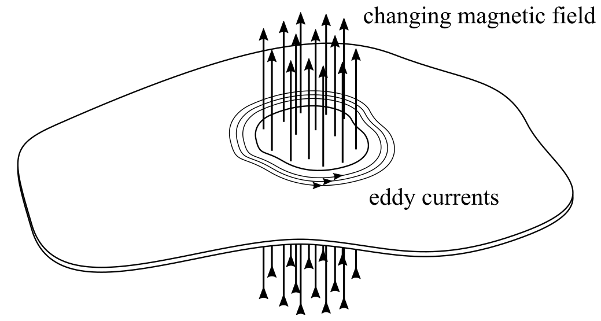

# Induction Heating: Effect of Current, Frequency and Workpiece Conductivity

[](https://opensource.org/licenses/MIT)

The power dissipated in a flat non-magnetic workpiece during induction
heating depends on coil current, excitation frequency and workpiece
conductivity. The attached [report](report.pdf) studies how power
dissipation is affected by these properties.

## The question and the answer

Consider a thin flat plate with in-plane dimensions significantly
larger than its thickness. Locally, the plate is subjected to a
uniform but changing magnetic field as is illustrated in the figure
below. Eddy currents will develop around the changing magnetic field,
as a result of which power is dissipated. Here, we assume the plate is
a non-magnetic conductor, which means power dissipation depends on
Joule heating only.

<p align="center">
  
</p>

We have asked ourselves the question how the dissipated power depends
on the coil current (amplitude and frequency), and on the workpiece
conductivity. This question has been answered for regimes, namely:
1. the regime where the plate is very thin compared to the penetration
   depth, and
2. the regime where the plate is very thick compared to the
   penetration depth.

In summary, we found that for the first regime, thus in case the plate
is thin compared to the penetration depth, the dissipated power
depends on coil current amplitude , frequency , and conductivity  as:

<p align="center">

</p>

while for the second regime these dependencies change to:

<p align="center">

</p>

The dependencies found for both regimes can be understood from the
underlying physics, i.e. from Ampère's, Faraday's, and Joule's Law. In
addition, the analytical derivation was supported by numerical analysis
for a slightly more realistic case.


## Simulation model and data

If you want to replicate the simulations presented in the report, or
simply play a bit with the model, feel free to clone the repository to
your folder of choice using [git](https://git-scm.com/downloads):

```
git clone https://github.com/wjbg/ih_power.git
```

The model was implemented in Comsol Multiphysics (v5.6). The data for
graphs in the report were generated by running multiple simulations
through Matlab. The full dataset can be generated by running the file
`simulation_data.m`.


## Citation

In case you make use of this work for scientific publications of any
kind, please cite it as:

```
@misc{Grouve2022_ih_power,
  author =       {Grouve, Wouter J.B.},
  title =        {Induction Heating - Influence of Current, Frequency, and Workpiece Conductivity},
  year =         {2022},
  publisher =    {Technical Report, University of Twente},
  journal =      {GitHub},
  howpublished = {\url{https://github.com/wjbg/ih_power}}}
```


## License

Free as defined in the [MIT](https://choosealicense.com/licenses/mit/)
license.
